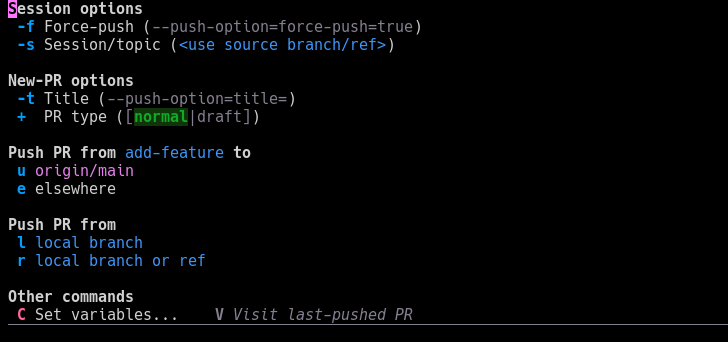

* AGitjo

AGitjo is a [[https://www.gnu.org/software/emacs/][GNU Emacs]] package that extends Magit with a new menu for AGit-Flow
operations, to make them more convenient for users.  The AGit workflow enables
users to create and edit pull requests using just the "git push" command.  This
package is intended specifically for use with Forgejo-based (e.g. Codeberg)
repositories.

See [[https://forgejo.org/docs/latest/user/agit-support/][Forgejo's documentation about AGit-Flow]] to learn more.

** Installation

[[https://packages.guix.gnu.org/packages/emacs-agitjo][file:https://packages.guix.gnu.org/packages/emacs-agitjo/badges/latest-version.svg]]

*** Guix

Aitjo is available as a [[https://guix.gnu.org/][GNU Guix]] package.

The stable version can be found in the ~(gnu packages emacs-xyz)~ module, under
the symbol ~emacs-agitjo~.  One may install it into the user profile like so:

#+begin_src sh
  guix install emacs-agitjo
#+end_src

This package may also be installed using the =guix.scm= file in this repository.
For example, to install to the user profile, one may run the following in this
repository's root directory:

#+begin_src emacs-lisp
  guix package --install-from-file=guix.scm
#+end_src

** Usage

Run the following to load AGitjo and set up key-bindings in the relevant Magit
keymap (in this example, we use =#=):
#+begin_src emacs-lisp
  (use-package agitjo
    :config (agitjo-setup "#"))
#+end_src

An average workflow might look like the following:
1. Write and commit some code, and eventually decide it's ready for a pull
   request.
2. Open Agitjo's transient menu with =M-x agitjo-push= or by inputting the =#=
   key inside a Magit status buffer.
3. Set options like the title (=-t=) and the session identifier (=-s=).
4. Invoke one of the push commands to execute a git-push operation.
5. If creating a new PR (the force-push option =-f= is disabled), a dedicated
   buffer will open for drafting a PR description.
6. Visit the created pull request's link (=V=) in a browser to inspect it and
   make any additional adjustments, if needed.
7. Repeat steps 1-4 with the force-push option (=-f=) enabled to push changes to
   the existing PR.
